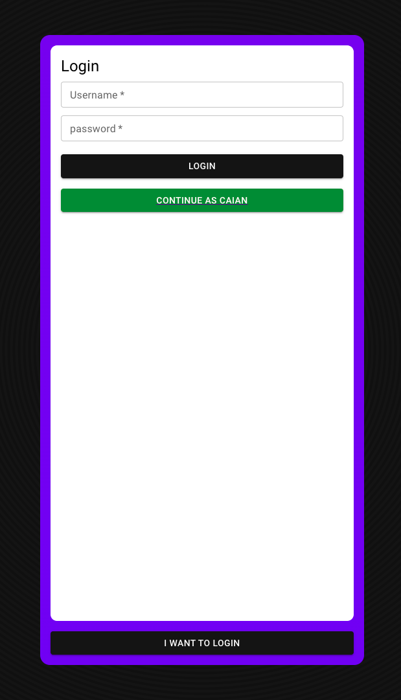
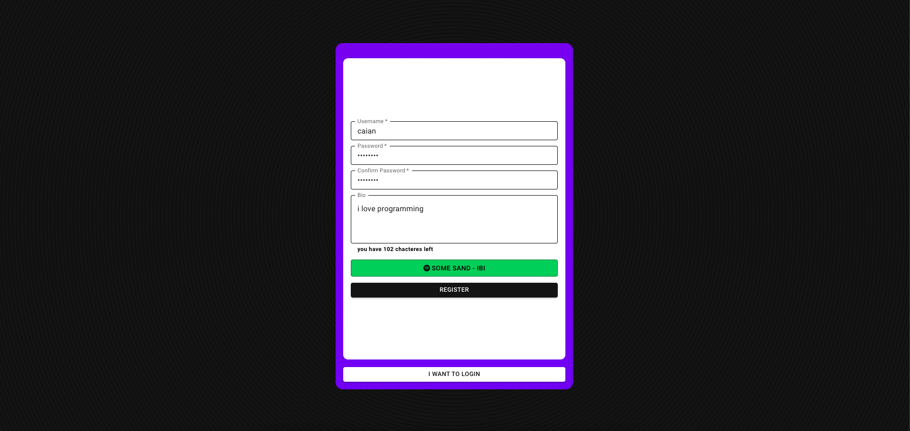
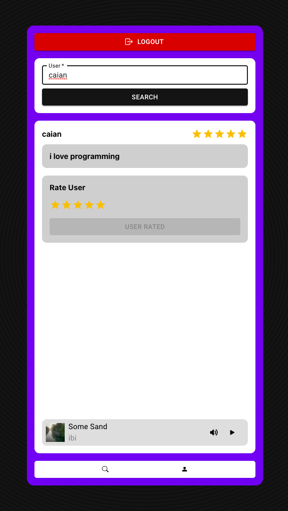

[<h1>**EIGHTY FOUR**</h1>](https://eightyfour.vercel.app)

### **Want an app that uses Redux to overkill simple state management in React to have fun with your friends? Try the [Eighty Four](https://eightyfour.vercel.app)**

## **About**
I created Eighty Four to learn, critique(social credit platforms) and demonstrate my knowledge in react. And I faced a lot of problems, and now, I not only learned a lot about React nesting, Re-renders and state, but how not to make a messy code. I'm a little proud, not for what Eighty Four became, but for what I learned from it. My latest projects couldn't be as good without Eighty Four.

## **Issues**

- [ ] Users rating not updating after rate added
- [ ] Logged user rating not update due Redux-Persist
- [x] Login feedback don't showing
- [x] Improve phones usebility
- [ ] Upgrade the host and change domain
- [x] The empty tab icon (this trigger me too)
- [x] Find more bugs to put here :D (it didn't even take too long)
- [x] The volume is reset to 0.5 each time the song is played

We are doing very well, hum

**If you wanna help**

Keep this in mind: to understand the folders, just think like that of the actual project. The folders are related to the real nest, like in the app. I thought it was the easiest way to have a good understanding of the code. Now, they just look kind of weird. But putting them in a single folder doesn't look very good to me.

Everything follows its respective documentation. Ex.: redux-toolkit says to put the store inside the application.  So you'll do fine.
