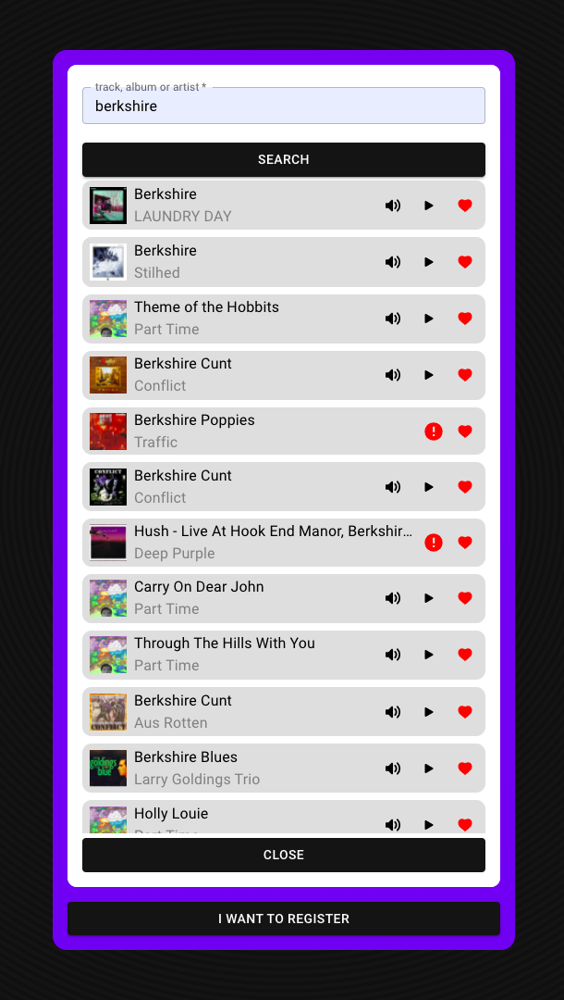

[<h1>**EIGHTY FOUR**</h1>](https://eighty4.herokuapp.com)

<h2>Structure</h2>

I like to use folders to mimic the project structure. So in the components folder, you can find all the global components, and you can go through folders to locate yourself as using the application. This way I can still have different components with different functions with same name.

In the **api** folder, each file in to a specfic piece from de project.

Redux setup follows the documentation: redux store in **/app**, as your api folder as well. The slices can be find in **/features**

<h2>Issues</h2>

All these issues will be resolved over time due to my lack of time, active studies and side projects.

- [ ] Users rating not updating after rate added
- [ ] Logged user rating not update due Redux-Persist
- [ ] Login erros not showing
- [ ] Improve phones usebility
- [ ] Upgrade the host and change domain
- [ ] The empty tab icon (this trigger me too)
- [ ] Find more bugs to put here :D

